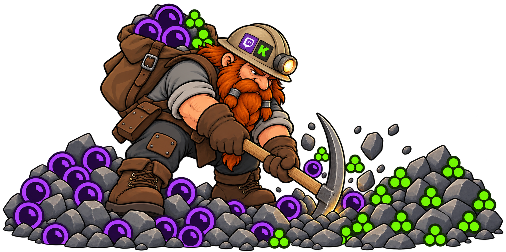

<p align="center">
  
</p>

<h1 align="center">Twitch Kick Points Miner</h1>

<blockquote>
  <p>
    This project was made possible by a fork of <a href="https://github.com/0x8fv/Twitch-Channel-Points-Miner">0x8fv/Twitch Channel Points Miner</a>.
  </p>
</blockquote>

<p align="center">
  A lightweight Go application that monitors followed Twitch and Kick channels, watches eligible live streams, tracks balances, and collects supported channel rewards from 1 terminal.
</p>

<p align="center">
  <a href="https://github.com/atalaydenknalbant/twitch-kick-points-miner/releases"></a>
  <a href="LICENSE"></a>
  
</p>

## Features

- Twitch and Kick mining run together in 1 process.
- Empty streamer lists automatically load followed channels on both platforms.
- Every followed Kick channel is listed at startup as online, offline, or unavailable when Kick cannot answer the status request.
- Follow lists refresh while the miner is running, so new follows can be discovered without restarting.
- Offline channels are polled without opening viewer connections and begin watching when they become live.
- Twitch bonuses, watch streaks, Moments, Drops, raids, and predictions are supported.
- Kick viewer WebSocket activity, points balance tracking, and watch rewards are supported.
- Terminal output uses Twitch and Kick platform marks, balance deltas, games, and session totals.
- Optional Discord events, saved logs, privacy anonymization, and per streamer overrides are included.
- Release checks use SHA256 verification before an automatic update is installed.


## Download

Download the file for your operating system from [GitHub Releases](https://github.com/atalaydenknalbant/twitch-kick-points-miner/releases):

| Operating system | Release asset |
| --- | --- |
| Windows x64 | `TwitchKickPointsMiner-windows-amd64.exe` |
| Windows ARM64 | `TwitchKickPointsMiner-windows-arm64.exe` |
| Linux x64 | `TwitchKickPointsMiner-linux-amd64` |
| Linux ARM64 | `TwitchKickPointsMiner-linux-arm64` |
| macOS Intel | `TwitchKickPointsMiner-darwin-amd64` |
| macOS Apple Silicon | `TwitchKickPointsMiner-darwin-arm64` |


## Quick Start

1. Place the executable in its own writable directory.
2. Run it once to create `config.json`.
3. Follow the terminal steps to copy the Kick `Authorization: Bearer ...` request header, or enter `Skip` for Twitch only.
4. Choose `Connect` to complete Twitch device login, or choose `Skip` to run Kick only.

The miner stores Twitch cookies under `cookies`, logs under `log`, and configuration beside the executable. Use `-config` or `-data-dir` to choose another location.

The preferred environment variables are `TKPM_CONFIG`, `TKPM_DATA_DIR`, and `TKPM_PLATFORM_LOGOS`. The older `SBPM_*` and `TCPM_*` configuration aliases remain available for existing shortcuts.

## Configuration

The program creates missing settings automatically. Important top level options are:

| Key | Default | Purpose |
| --- | --- | --- |
| `twitch.enabled` | `true` | Enable Twitch login and mining. Set to `false` for Kick only mode. |
| `auto_update` | `true` | Check this repository for a newer verified release during startup. |
| `streamers` | `[]` | Empty watches followed Twitch channels. Add logins for a manual list. |
| `streamers_exclude` | `[]` | Skip matching Twitch channels. |
| `claim_drops_startup` | `true` | Check Twitch Drops inventory during startup. |
| `claim_drops` | `true` | Continue checking and claiming supported Twitch Drops. |
| `show_drops_progress` | `false` | Print compact progress during inventory checks. |
| `claim_moments` | `true` | Claim supported Twitch Moments. |
| `follow_raid` | `true` | Follow supported Twitch raid transitions. |
| `betting(make_predictions)` | `true` | Enable configured Twitch prediction betting. |
| `watch_streak_warm_start_cache` | `true` | Reuse recent streak state after a short restart. |
| `show_game` | `true` | Include the current game in status and reward messages. |
| `save_logs` | `false` | Save terminal events under `log`. |
| `privacy.anonymize_logs` | `false` | Hide channel names and balances in output. |

### Kick

```json
"kick": {
  "enabled": true,
  "setup_completed": true,
  "setup_version": 5,
  "check_interval": 120,
  "points_interval": 150,
  "handshake_interval": 30,
  "watch_event_interval": 10,
  "reconnect_cooldown": 60,
  "connection_stagger_min": 3,
  "connection_stagger_max": 8,
  "accounts": [
    {
      "alias": "Main Kick Account",
      "credential_file": "cookies/kick_main_kick_account.json",
      "streamers": [],
      "max_concurrent": 2
    }
  ]
}
```

Leave a Kick account `streamers` array empty to load every channel followed by that account. A nonempty array keeps manual priority order. Followed channels are refreshed every `check_interval`. Only live channels receive viewer connections.

Kick setup never opens or controls a browser. Open `https://kick.com/following` in your normal signed in browser, press `F12`, select `Network`, reload the page, and filter for `followed`. Open the `/api/v2/channels/followed` request, expand `Request Headers`, and copy the complete `Authorization: Bearer ...` value into the terminal. You can also paste only the value after `Bearer`.

Treat the Kick bearer token like a password. It is saved in the ignored `cookies/kick_<account>.json` file and is never printed by the miner. `config.json` stores only the credential file path. Existing `token` values in older configurations are migrated automatically and removed from serialized configuration.

The setup accepts `Authorization: Bearer TOKEN`, `Bearer TOKEN`, or only `TOKEN`. It always stores only the token. Mining starts after Kick setup and Twitch authentication are both complete. When Kick is skipped, mining starts after Twitch authentication.

### Twitch

Initial setup offers `Connect` or `Skip`. `Connect` starts Twitch device activation after all platform choices are saved. `Skip` disables Twitch and runs Kick only. Run `TwitchKickPointsMiner.exe -setup-twitch` to change this choice later, or set `twitch.enabled` in `config.json`.

```json
"twitch": {
  "enabled": true
}
```

Run `TwitchKickPointsMiner.exe -connect-kick` whenever you want to connect Kick after skipping it or replace an expired Kick session.

### Twitch Overrides

Per streamer settings inherit global values and can override mining behavior:

```json
"streamer_overrides": {
  "examplechannel": {
    "make_predictions": false,
    "follow_raid": true,
    "claim_drops": true,
    "claim_moments": true,
    "watch_streak": true,
    "community_goals": false,
    "chat_presence": "ONLINE"
  }
}
```

## Automatic Updates

Automatic updates use only the latest release from this repository. The updater performs these steps:

1. Compare the local semantic version with the latest GitHub release tag.
2. Select the exact asset for the current operating system and architecture.
3. Download its matching SHA256 file.
4. Verify the executable before installation.
5. Start the verified executable as a temporary helper.
6. Replace and restart the original executable without a batch script.

Set `"auto_update": false` to disable this check. Development runs started with `go run .` are never replaced.

## Build From Source

Go `1.27` or newer is required.

```powershell
go test ./...
go vet ./...
go build -o TwitchKickPointsMiner.exe .
```

Windows, Linux, and macOS release files can be built with:

```powershell
./build.ps1
```

## License

The project is distributed under the [Creative Commons Attribution NonCommercial 4.0 International license](LICENSE). Attribution and change notices for the upstream fork must be retained. Commercial use is not granted by this license.
